### Introduction to Phishing 
---

## **Starting my Investigation**

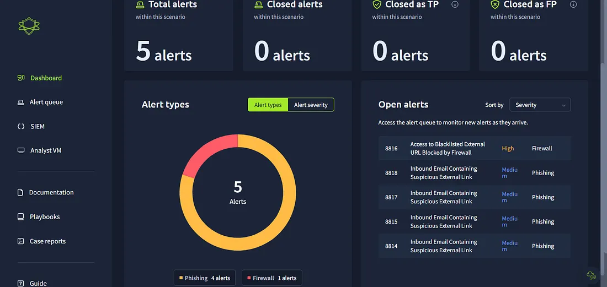

The first thing we notice is that there are **5 alerts** in total (4 medium phishing alerts and one higher-severity firewall alert).

> While we should ideally start with the higher severity alert, we will begin with the phishing alerts.

---

## **First Alert – 8814: Inbound Email Containing Suspicious External Link**

First, we review the content and description of the alert:

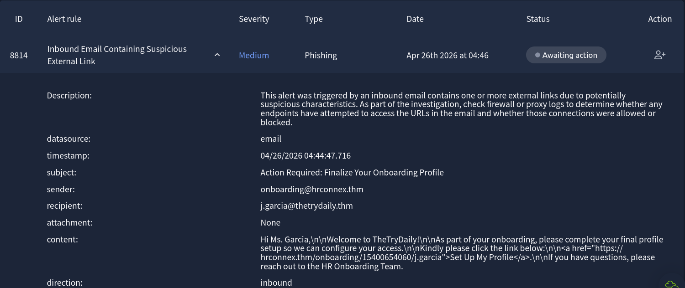

After reviewing the alert, we take ownership of it:

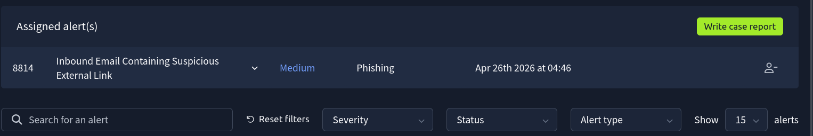

Now, we investigate the domain and URL since the alert was triggered due to an external link in the email.

We search for `j.garcia@thetrydaily.thm` in the SIEM and find 4 events. Upon careful inspection, we see that the recipient **did not click the link**.

To confirm this, we further analyze the domain and URL using online sandboxes such as **VirusTotal** and **AnyRun**:

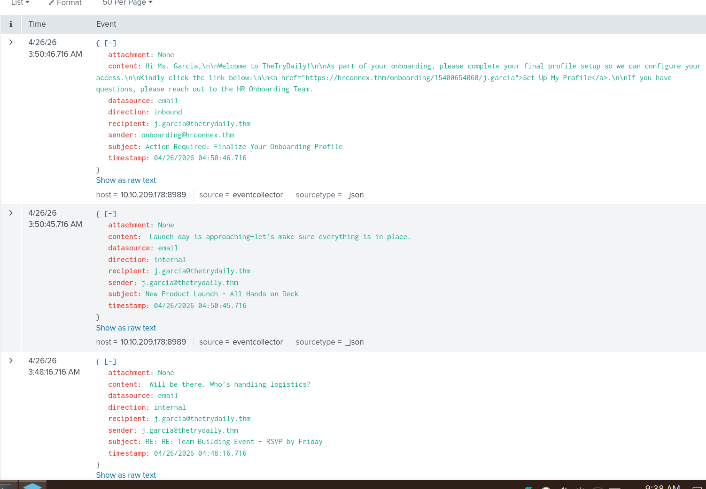

The domain and URL appear clean, so this is likely a **false positive**.

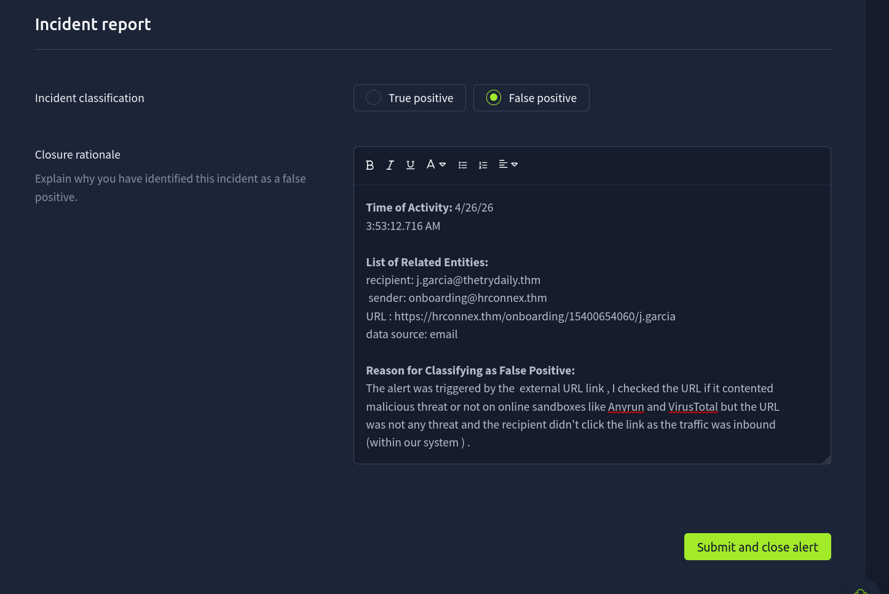

---

## **Second Alert – 8816: Access to Blacklisted External URL Blocked by Firewall**

This alert was triggered when a user attempted to access a URL that is on the organization's blacklist.

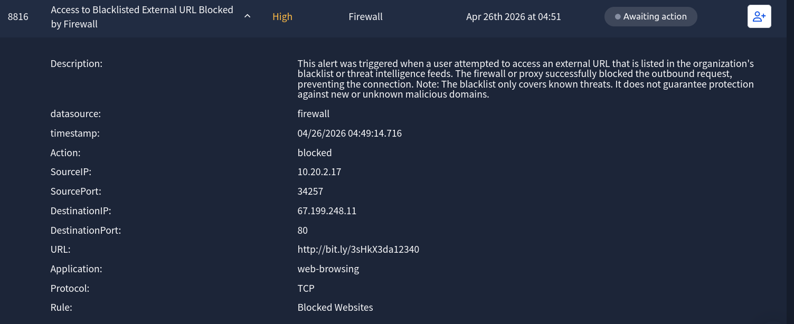

Now, we verify whether the firewall blocked or allowed the request:

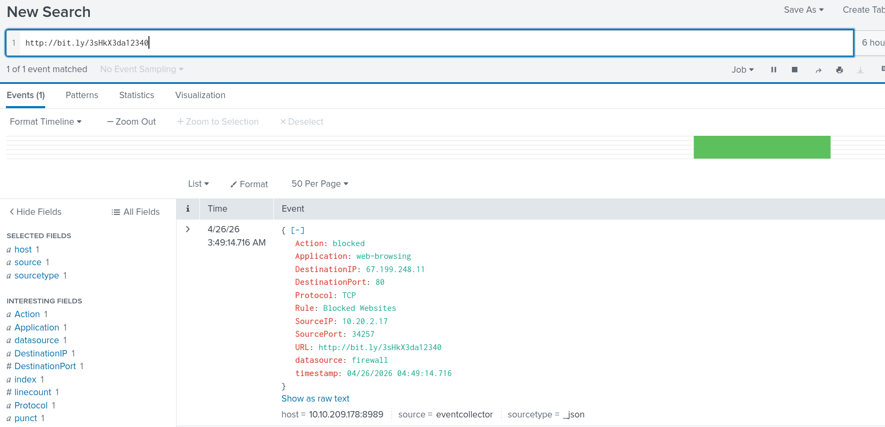

The logs clearly show that the request was **blocked by the firewall**.

Therefore, this is a **true positive**—the user attempted to access a malicious URL, but the firewall successfully blocked it.

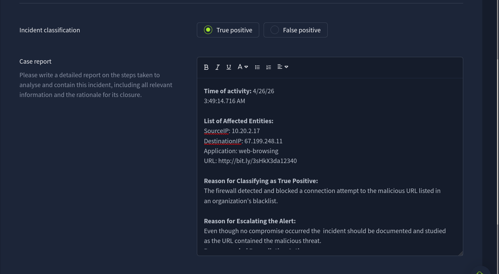

This does not require further escalation since the firewall prevented any compromise.

---

## **Third Alert – 8817: Inbound Email Containing Suspicious External Link**

From the alert description, we can see that the sender domain looks suspicious and includes an external link.

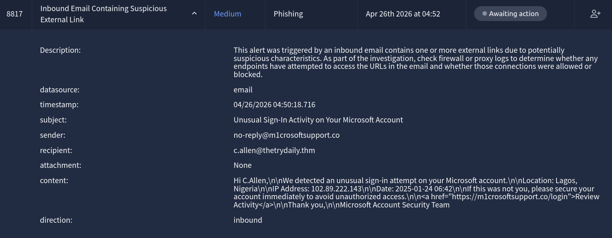

This appears to be a phishing attempt impersonating Microsoft, creating urgency and using a deceptive domain.

Next, we check in the SIEM (Splunk) whether the user clicked the link:

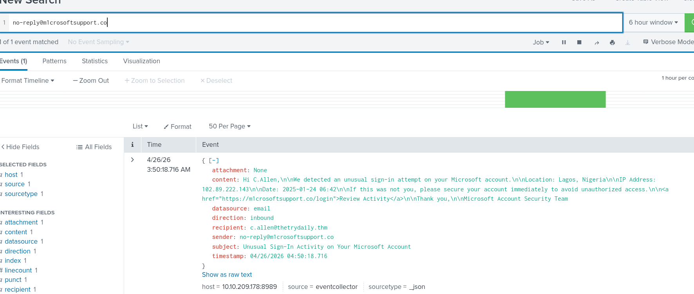

The logs show that the recipient **did not click the link**, which is a good sign.

So, this is a **true positive**, but no compromise occurred.

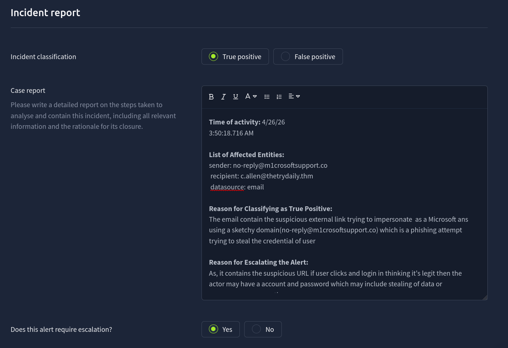

### Recommendation:
- Reset user credentials  
- Provide user awareness training  
- Block the malicious domain via firewall  
- Inform the recipient about the phishing attempt  

---

## **Fourth Alert – 8815: Inbound Email Containing Suspicious External Link**

This email has several red flags:
- The sender domain (`urgents@amazon.biz`) is not legitimate  
- It creates urgency (“package will be returned within 48 hours”)  
- It uses a shortened link (bit.ly) to hide the destination  

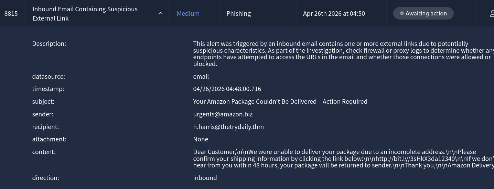

We check in the SIEM whether the user clicked the link:

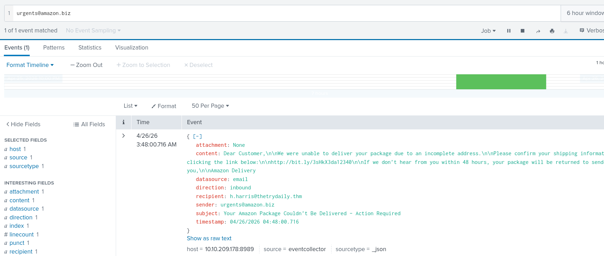

The logs show that the user **did not click the link**, meaning no compromise occurred.

This is a **true positive**, but does not require escalation.

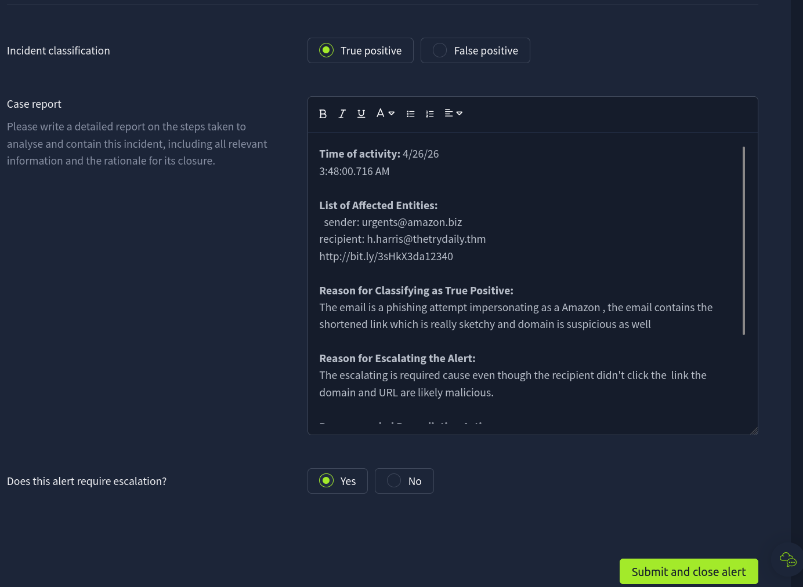

### Action:
- Block the domain and URL  
- Notify the user  
- Reinforce phishing awareness  

---

## **We are safe… (until the next alert)**

---

***Alish***
